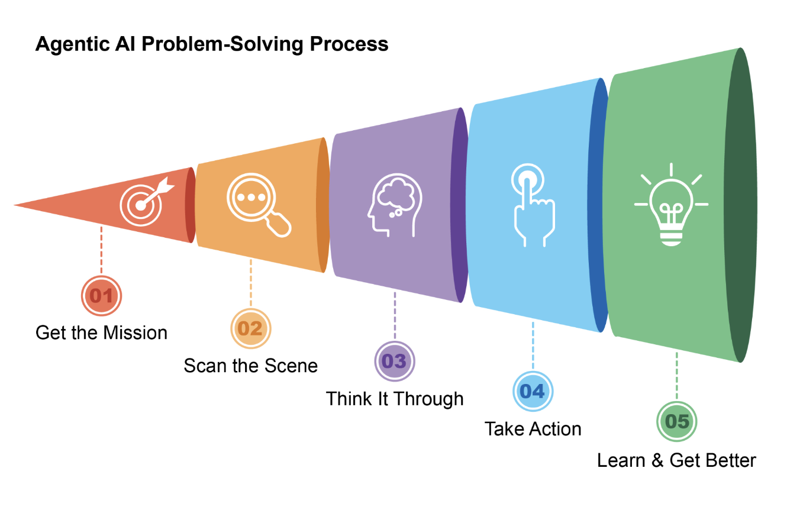
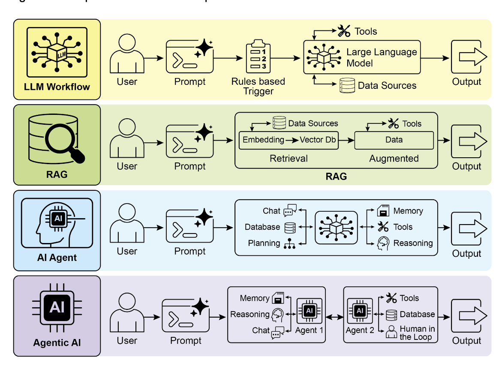

# What Makes an AI System an Agent? 

AI-agents -> A system designed to percieve its environment and take actions to achieve a specific goal. 
- It's an evoluation from a standard LLM, with a abilities to plan, use tools and interact with its surroundings
- Think of an Agentic AI as a smart assistant that learns on the job.
- Its follows a simple, five-step loop to get things done:
    1. Get the Mission: You give it a goal, like "organize my schedule."
    2. Scan the Scene: It gathers all the necessary information—reading emails,
    checking calendars, and accessing contacts—to understand what's happening.
    3. Think It Through: It devises a plan of action by considering the optimal
    approach to achieve the goal.
    4. Take Action: It executes the plan by sending invitations, scheduling meetings,
    and updating your calendar.
    5. Learn and Get Better: It observes successful outcomes and adapts accordingly.
    For example, if a meeting is rescheduled, the system learns from this event to
    enhance its future performance.

> Agentic AI functions as an intelligent assistant, continuously learning through experience. It operates via a straightforward five-step loop to accomplish tasks

## Evoluation
In just two years, the AI paradigm has shifted dramatically, moving from **simple automation** ->  sophisticated, **autonomous systems** 

- Initially, *workflows* relied on basic prompts and triggers to process data with *LLMs*. This evolved with
- Retrieval-Augmented Generation (*RAG*), which enhanced reliability by *grounding* models on *factual* information. We then saw the development of 
- individual *AI Agents*, capable of using various tools. 
- Today, we are entering the era of *Agentic AI*, where a *team of specialized agents* works in concert to achieve complex goals, marking a significant leap in AI's collaborative power.

