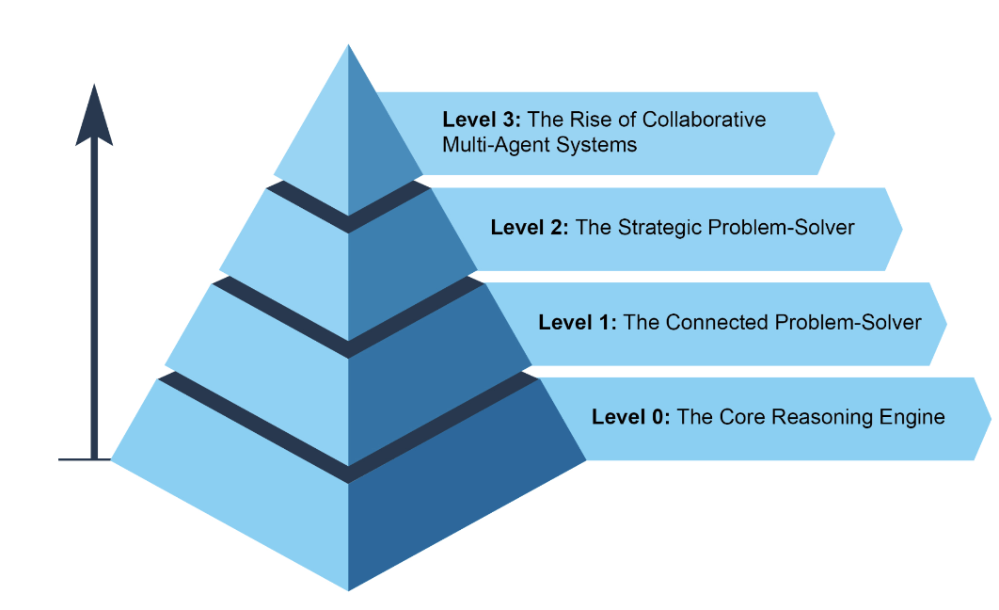

## Agent Complexities 

### Level 0: The Core Reasoning Engine

While an LLM is not an agent in itself, it can serve as the reasoning core of a basic agentic system

- In a '**Level 0**' configuration, the **LLM operates *without* tools, memory, or environment interaction**, responding solely *based on its pretrained knowledge.* 
- Its strength lies in leveraging its extensive *training data* to explain established concepts.
- The trade-off for this *powerful internal reasoning* is a complete lack of current-event
awareness. 
- For instance, it would be unable to name the *2025 Oscar winner* for "Best Picture" if that information is outside its *pre-trained knowledge*.

### Level 1: The Connected Problem Solver 

At this level, the LLM becomes a *functional agent* by connecting to and utilizing *external tools* 

- Its problem-solving is no longer limited to its pre-trained knowledge. 
- Instead, it can *execute a sequence of actions* to gather and *process information* from sources like the internet (via search) or databases (via Retrieval Augmented Generation, or RAG).
- For instance, to *find new TV shows*, the agent recognizes *the need for current information*, uses a search tool to *find* it, and then *synthesizes* the results.

This ability to **interact with the outside world** across multiple steps is the core *capability* of a Level 1 agent

### Level 2: The Strategic Problem-Solver

At this level, an agent's capabilities expand significantly, **encompassing strategic planning, proactive assistance, and self-improvement**, with *prompt engineering* and
*context engineering* as core enabling skills.

- First, the agent moves beyond *single-tool* use to tackle *complex*, multi-part problems
through strategic problem-solving.
- As it executes a *sequence of actions*, it actively *performs context engineering*: the strategic process of selecting, packaging, and managing the most relevant information for each step. 
- For example, to find a coffee shop between two locations, it first uses a mapping tool. It then engineers this output, curating a short, focused context—perhaps just a list of street names—to feed into a local search tool, preventing cognitive overload and ensuring the second step is efficient and accurate. 
- To achieve *maximum accuracy* from an AI, it must be *given a short, focused, and powerful context*

> **Context engineering** is the discipline that accomplishes this by *strategically selecting, packaging, and managing the most critical information* from all available sources. It effectively curates the model's *limited attention* to **prevent overload** and ensure **high-quality, efficient performance** on any given task. 

This level leads to **proactive and continuous operation**
- A travel assistant linked to your email demonstrates this by engineering the context from a verbose flight confirmation email; it selects only the key details (flight numbers, dates, locations) to package for subsequent tool calls to your calendar and a weather API.

Finally, the agent **achieves self-improvement** by refining its own context engineering
processes. 
- When it asks for feedback on how a prompt could have been improved, it is learning how to better curate its initial inputs. 
- This allows it to automatically improve how it packages information for future tasks, creating a powerful, automated feedback loop that increases its accuracy and efficiency over time.

### Level 3: The Rise of Collaborative Multi-Agent Systems

At Level 3, we see a significant paradigm shift in AI development, *moving* away from the **pursuit of a single**, all-powerful super-agent and towards the rise of sophisticated, **collaborative multi-agent systems**. 
- In essence, this approach recognizes that **complex challenges** are often best solved not by a single generalist, but by a team of specialists working in concert. 
- This model directly *mirrors* the structure of a *human* organization, where different departments are assigned specific roles and collaborate to tackle multi-faceted objectives. 
- The *collective strength* of such a system lies in this division of labor and the synergy created through *coordinated effort*.

To bring this concept to life, consider the intricate **workflow of launching a new product.**
- Rather than one agent attempting to handle every aspect, a "Project Manager" agent could serve as the central coordinator. 
- This manager would orchestrate the entire process by delegating tasks to other specialized agents:
    - a "Market Research" agent to gather consumer data, 
    - a "Product Design" agent to develop concepts, and 
    - a "Marketing" agent to craft promotional materials. 
- The key to their success would be the seamless communication and information sharing between them, ensuring all individual efforts align to achieve the collective goal.

While this vision of autonomous, team-based automation is already being developed, it's important to acknowledge the current **hurdles**. 
- The *effectiveness* of such multi-agent systems is presently constrained by the **reasoning** limitations of LLMs they are using.
- Furthermore, their *ability to genuinely learn from one another* and improve as a cohesive unit is still in its early stages. 
- Overcoming these technological bottlenecks is the critical next step, and doing so will unlock the profound promise of this level: the ability to **automate entire business workflows** from start to finish.

