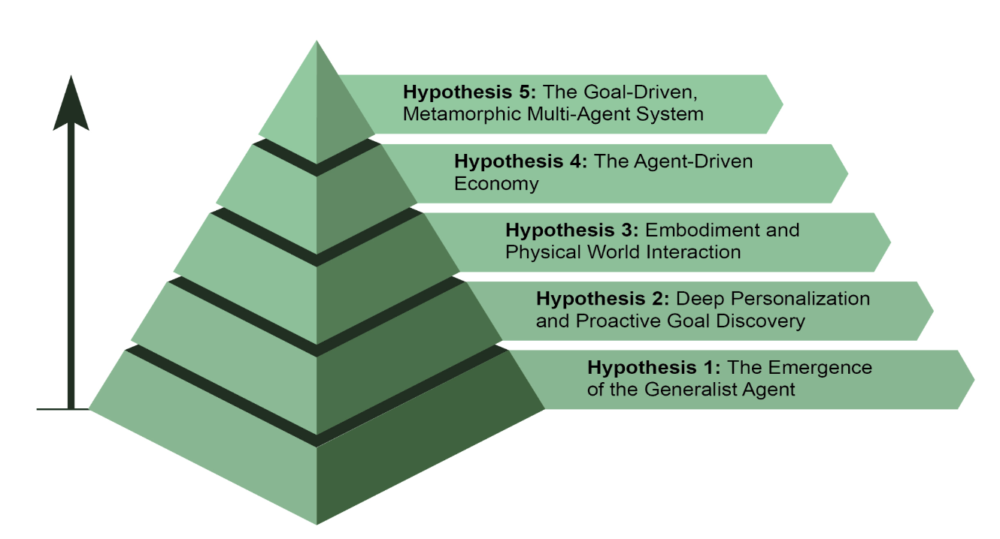

## The Future of Agents: Top 5 Hypotheses

AI agent development is progressing at an unprecedented pace across domains such as software automation, scientific research, and customer service among others. 

While current systems are impressive, they are just the beginning. The next wave of innovation will likely focus on making agents more reliable, collaborative, and deeply integrated into our lives.

### Hypothesis 1: The Emergence of the Generalist Agent

The first hypothesis is that AI agents will evolve from narrow specialists into true generalists capable of managing 
- complex, 
- ambiguous, and 
- long-term goals with high reliability.

For instance, you could give an agent a simple prompt like, "Plan my company's offsite retreat for 30 people in Lisbon next quarter."
- The agent would then manage the entire project for weeks, handling everything from budget approvals and flight negotiations to venue selection and creating a detailed itinerary from employee
feedback, all while providing regular updates. 
- Achieving this level of autonomy will require fundamental breakthroughs in **AI reasoning, memory, and near-perfect reliability.**

An alternative, yet not mutually exclusive, approach is the rise of Small Language Models (SLMs). This "Lego-like" concept involves composing systems from small, specialized expert agents rather than scaling up a single monolithic model. 

This method promises systems that are *cheaper, faster to debug, and easier* to deploy. Ultimately,
the development of large generalist models and the composition of smaller specialized ones are both plausible paths forward, and they could even complement each other.

### Hypothesis 2: Deep Personalization and Proactive Goal Discovery

The second hypothesis posits that agents will become deeply personalised and proactive partners. We are witnessing the emergence of a new class of agent: the proactive partner. By learning from your unique patterns and goals, these systems are beginning to shift from just following orders to anticipating your needs

AI sysems operate as agents when they move beyond simply responding to chats or instructions.
- They initiate and execute tasks on behalf of the user, actively collaborating in the process. 
- This moves beyond simple task execution into the realm of proactive goal discovery.

For instance, if you're exploring sustainable energy, the agent might identify your latent goal and proactively support it by suggesting courses or summarizing research. 

- While these systems are still developing, their trajectory is clear. 
- They will become increasingly proactive, learning to take initiative on your behalf when highly confident
that the action will be helpful. 
- Ultimately, the agent becomes an indispensable ally, helping you discover and achieve ambitions you have yet to fully articulate.

### Hypothesis 3: Embodiment and Physical World Interaction

This hypothesis foresees agents breaking free from their purely digital confines to operate in the physical world. By integrating agentic AI with robotics, we will see the rise of "**embodied agents.**" Instead of just booking a handyman, you might ask your home agent to fix a leaky tap. 

The agent would use its vision sensors to perceive the problem.
- access a library of plumbing knowledge to formulate a plan, and then control its robotic
- manipulators with precision to perform the repair. 

This would represent a monumental step, bridging the gap between digital intelligence and physical action, and transforming everything from manufacturing and logistics to elder care and home maintenance.

### Hypothesis 4: The Agent-Driven Economy

The fourth hypothesis is that *highly autonomous agents* will become active participants in the economy, creating **new markets and business models**.

- An entrepreneur could launch an agent to run an entire e-commerce business. The agent would identify trending products by analysing social media, generate marketing copy and visuals, manage supply chain logistics by interacting with other automated systems, and dynamically adjust pricing based on real-time demand.

- This shift would create a new, hyper-efficient "agent economy" operating at a speed and
scale impossible for humans to manage directly

### Hypothesis 5: The Goal-Driven, Metamorphic Multi-Agent System

This hypothesis posits the emergence of intelligent systems that operate not from explicit programming, but from a declared goal. The user simply states the desired outcome, and the **system autonomously figures out how to achieve it**. This marks a fundamental shift towards metamorphic multi-agent systems capable of true
self-improvement at both the individual and collective levels.

This system would be a dynamic entity, not a single agent. It would have the ability to analyze its own performance and modify the topology of its **multi-agent workforce, creating, duplicating, or removing** agents as needed to form the most effective team for the task at hand.

This evolution happens at multiple levels:

- **Architectural Modification**: At the deepest level, individual agents can rewrite their own source code and re-architect their internal structures for higher efficiency, as in the original hypothesis.

- **Instructional Modification**: At a higher level, the system continuously performs automatic prompt engineering and context engineering. It refines the instructions and information given to each agent, ensuring they are operating with optimal guidance without any human intervention.

For instance, an entrepreneur would simply declare the intent: "Launch a successful e-commerce business selling artisanal coffee." 
- The system, without further programming, would spring into action. 
- It might initially spawn a "*Market Research*" agent and a "*Branding*" agent. 
- Based on the initial findings, it could decide to *remove* the branding agent and spawn three new specialized agents: a "*Logo Design*" agent, a "Webstore Platform" agent, and a "Supply Chain" agent.

**It would constantly tune their internal prompts for better performance**

If the webstore agent becomes a bottleneck, the system might duplicate it into three parallel agents to work on different parts of the site, effectively re-architecting its own structure on the fly to best achieve the declared goal.

