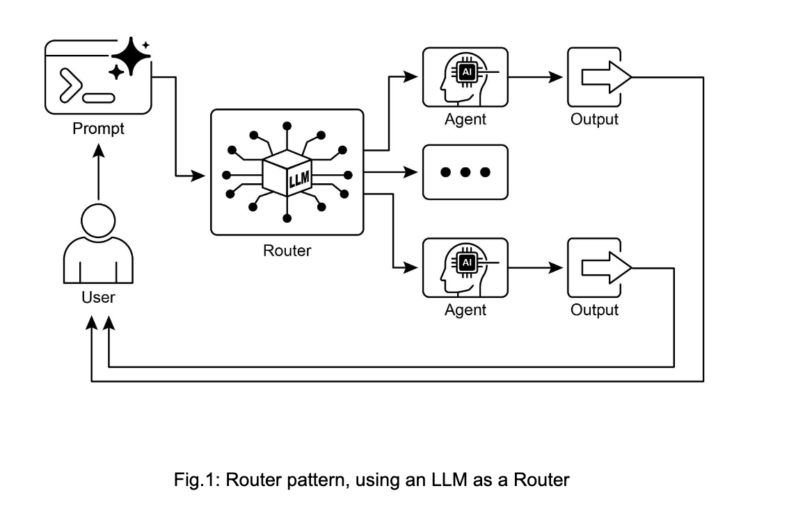

# Routing 

While sequential processing via **prompt chaining** is a foundational technique for executing ***deterministic, linear workflows*** with language models, its applicability is
limited in scenarios requiring adaptive responses.

Routing introduces ***conditional logic*** into an agent's operational framework, enabling a **shift from a fixed execution path to a model where the agent dynamically evaluates specific criteria** to select from a set of possible subsequent actions. This allows for more flexible and context-aware system behavior.

For instance, an agent designed for customer inquiries, when equipped with a routing function, can first classify an **incoming query to determine the user's intent**.
- Based on this classification, it can then direct the query to a specialized agent for direct
    - question-answering, 
    - a database retrieval tool for account information, 
    - or an escalation procedure for complex issues, 
    - rather than defaulting to a single, predetermined response pathway.

Sophisticated agent using outing could:

1. Analyze the user's query.
2. Route the query based on its intent:
    - If the intent is "check order status", route to a sub-agent or tool chain that interacts with the order database.
    - If the intent is "product information", route to a sub-agent or chain that searches the product catalog.
    - If the intent is "technical support", route to a different chain that accesses troubleshooting guides or escalates to a human.
    - If the intent is unclear, route to a clarification sub-agent or prompt chain

## Routing Ways 

1. **LLM-based Routing**: The language model itself can be **prompted to analyze the input and output** a specific identifier or instruction that indicates the next step or destination.

    - For example, a prompt might ask the LLM to "Analyze the following user query and output only the category: 'Order Status', 'Product Info', 'Technical Support', or 'Other'." 
    - The *agentic system then reads this output and directs* the workflow accordingly.

2. **Embedding-based Routin**g: The input query can be **converted into a vector embedding**. 

    - This embedding is then compared to embeddings representing different routes or capabilities. 
    - The query is routed to the route whose embedding is most similar. 
    - This is useful for semantic routing, where the decision is based on the meaning of the input rather than just keywords.

3. **Rule-based Routing**: This involves using **predefined rules or logic** (e.g., if-else statements, switch cases) based on keywords, patterns, or structured data extracted from the input. 

    This can be faster and more deterministic than LLM-based routing, but is less flexible for handling nuanced or novel inputs.

4. **Machine Learning Model-Based Routing**: it employs a **discriminative model, such as a classifier**, that has been **specifically trained on a small corpus of labeled data** to perform a routing task. 

    - While it shares conceptual similarities with embedding-based methods, its key characteristic is the supervised fine-tuning process, which adjusts the model's parameters to create a specialized routing function. - This technique is distinct from LLM-based routing because the decision-making component is not a generative model executing a prompt at inference time. 
    - Instead, the routing logic is encoded within the fine-tuned model's learned weights. 
    - While LLMs may be used in a pre-processing step to generate synthetic data for augmenting the training set, they are not involved in the real-time routing decision itself.

Routing mechanisms can be implemented at multiple junctures within an agent's operational cycle. They can be applied at the outset to **classify a primary task**, at intermediate points within a **processing chain** to determine a subsequent action, or during a subroutine to **select the most appropriate tool** from a given set.

> The implementation of routing enables a system to move beyond deterministic sequential processing. It facilitates the development of more adaptive execution flows that can respond dynamically and appropriately to a wider range of inputs and state changes.

## Practical Applications & Use Cases

### 🤖 **1. Routing in Human–Computer Interaction**

* Used by **virtual assistants, chatbots, AI tutors**, etc.
* Helps interpret **user intent** from natural language queries.
* Based on analysis of the query, the system decides the next action:

  * Invoke an **information retrieval tool**
  * **Escalate** to a human operator
  * Pick the **next teaching module** based on learner progress
* Allows conversation to move **beyond linear flows** → more contextual, intelligent responses.

### 🗂️ **2. Routing in Data & Document Processing**

* Works as a **classification and distribution engine**.
* Analyses incoming items like:

  * Emails
  * Support tickets
  * API payloads
* Routing decisions can include:

  * Sending a sales inquiry to the **lead pipeline**
  * Choosing specific transformation logic (e.g., **JSON vs CSV**)
  * Escalating urgent issues
* Ensures every data item reaches the **correct workflow** automatically.

### 🧠 **3. Routing in Multi-Agent or Multi-Tool Systems**

* Acts as a **high-level dispatcher** between specialized agents/tools.
* Example: A research system with separate agents for:

  * Searching
  * Summarizing
  * Analyzing
    → The router assigns tasks to the right agent based on the goal.
* In AI coding assistants, routing helps:

  * Detect programming language
  * Identify intent: **debug**, **explain**, **refactor**, **translate**
  * Pass code to the appropriate specialized component.

## Why Routing Is Essential

* Enables **logical decision-making** within the system.
* Makes the system **context-aware** and adaptable.
* Converts the agent from a **static executor** → to a **dynamic decision-maker**.
* Helps choose the **best method** to achieve goals under changing conditions.

## Key Takeaways
- Routing enables agents to make ***dynamic decisions*** about the **next step in a workflow** based on conditions.
- It allows agents to **handle diverse inputs and adapt** their behavior, moving beyond linear execution.
- Routing logic can be **implemented using LLMs, rule-based systems, or embedding** similarity.