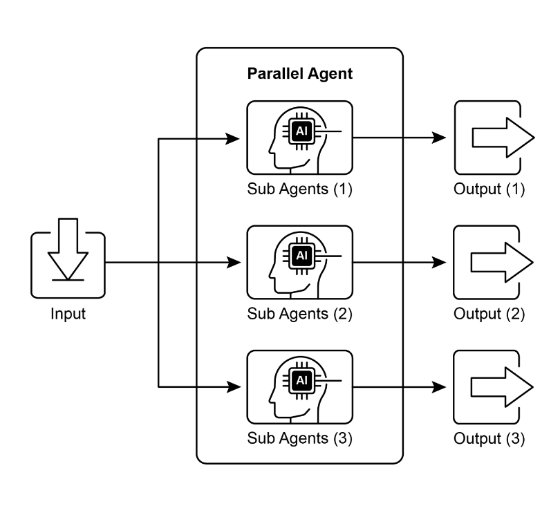

# Parallelization

Prompt Chaining for sequential workflows

Routing for dynamic decision-making and transitions between different paths.

Parallelization involves executing multiple components, such as LLM calls, tool usages, or even entire sub-agents, concurrently.

- Instead of waiting for one step to complete before starting the next, 
- parallel execution allows independent tasks to run at the same time, 
- significantly reducing the overall execution time for tasks that can be 
- broken down into independent parts.

```
+-------------- SEQUENTIAL FLOW ---------------------+       +------------------------ PARALLEL FLOW -----------------------------+

        +----------------------+
        |  Search Source A     |
        +----------------------+
                   |                                                  +-----------------------------------------------+
                   v                                                  |        PARALLEL: SEARCH BOTH SOURCES          |
        +----------------------+
        | Summarize Source A   |                                      +-----------------------------------------------+
        +----------------------+                                                       /                         \
                   |                                                                  v                           v
                   v                                                   +----------------------+      +----------------------+
        +----------------------+
        |  Search Source B     |                                       |  Search Source A     |      |  Search Source B     |
        +----------------------+                                       +----------------------+      +----------------------+
                   |                                                               \                         /
                   v                                                                \_______________________/
        +----------------------+
        | Summarize Source B   |                                                              |
        +----------------------+                                                              v
                |                                                   +-----------------------------------------------+
                v                                                   |   PARALLEL: SUMMARIZE BOTH SOURCES            |
        +-------------------------------+                            +-----------------------------------------------+
        | Synthesize Final Answer (A,B) |                                         /                         \
        +-------------------------------+                                       v                             v
                                                                     +----------------------+      +----------------------+
                                                                     | Summarize Source A   |      | Summarize Source B   |
                                                                     +----------------------+      +----------------------+
                                                                                   \                         /
                                                                                    \_______________________/
                                                                                                |
                                                                                                v
                                                                        +-------------------------------+
                                                                        | Synthesize Final Answer (A,B) |
                                                                        +-------------------------------+
```

The core idea is to **identify parts of the workflow that do not depend on the output of other parts** and execute them in ***parallel***. 
- This is particularly effective when dealing with external services (like APIs or databases) that have ***latency***, as you can ***issue multiple requests concurrently***
- Implementing parallelization often **requires** frameworks that support ***asynchronous execution or multi-threading/multi-processing***. 



## Practical Applications & Use Cases

### **1. Information Gathering & Research**

```
Use Case: Agent researching a company

                    +---------------------------------------+
                    |     COMPANY RESEARCH (PARALLEL)       |
                    +---------------------------------------+
                         /          |           |          \
                        v           v           v           v
              +-------------+ +-------------+ +-------------+ +----------------+
              |  News Scan  | | Stock Data  | | Social Buzz | | Company DB     |
              +-------------+ +-------------+ +-------------+ +----------------+
                         \          |           |          /
                          \_________|___________|_________/
                                      |
                                      v
                         +----------------------------------+
                         |   Combined Company Insight       |
                         +----------------------------------+

Benefit: Fast, comprehensive research overview.
```

---

### **2. Data Processing & Analysis**

```
Use Case: Agent analyzing customer feedback

                  +---------------------------------------------+
                  |    CUSTOMER FEEDBACK ANALYSIS (PARALLEL)    |
                  +---------------------------------------------+
                         /         |          |           \
                        v          v          v            v
          +----------------+ +--------------+ +--------------+ +------------------+
          | Sentiment Eval | | Keyword Ext | | Categorizing | | Urgent Issue ID  |
          +----------------+ +--------------+ +--------------+ +------------------+
                         \         |          |           /
                          \________|__________|__________/
                                      |
                                      v
                      +-------------------------------------------+
                      |   Multi-Dimensional Feedback Summary      |
                      +-------------------------------------------+

Benefit: Rich analysis generated quickly.
```

---

### **3. Multi-API or Tool Interaction**

```
Use Case: Travel planning agent

                     +-------------------------------------------+
                     |         TRAVEL PLANNING (PARALLEL)        |
                     +-------------------------------------------+
                          /         |            |            \
                         v          v            v             v
         +------------------+ +----------------+ +----------------+ +------------------+
         | Flight Prices    | | Hotel Search  | | Local Events   | | Food Suggestions |
         +------------------+ +----------------+ +----------------+ +------------------+
                          \         |            |            /
                           \________|____________|___________/
                                        |
                                        v
                       +---------------------------------------------+
                       |      Complete Travel Recommendations        |
                       +---------------------------------------------+

Benefit: Full travel plan produced faster.
```
---

### **4. Content Generation with Multiple Components**

```
Use Case: Agent creating a marketing email

                 +------------------------------------------------+
                 |        MARKETING EMAIL CREATION (PARALLEL)     |
                 +------------------------------------------------+
                       /            |             |            \
                      v             v             v             v
        +------------------+ +----------------+ +----------------+ +---------------------+
        | Subject Line     | | Email Body    | | Image Search   | | CTA Button Text     |
        +------------------+ +----------------+ +----------------+ +---------------------+
                       \            |             |            /
                        \___________|_____________|___________/
                                        |
                                        v
                      +-----------------------------------------------+
                      |         Final Marketing Email Output          |
                      +-----------------------------------------------+

Benefit: Faster assembly of complete content.
```

---

### **5. Validation & Verification**

```
Use Case: Agent verifying user input

                   +------------------------------------------------+
                   |       INPUT VALIDATION (PARALLEL CHECKS)       |
                   +------------------------------------------------+
                         /          |            |            \
                        v           v            v             v
        +-------------------+ +---------------+ +----------------+ +--------------------+
        | Email Format Check| | Phone Validity| | Address Lookup | | Profanity Check    |
        +-------------------+ +---------------+ +----------------+ +--------------------+
                         \          |            |            /
                          \_________|____________|___________/
                                      |
                                      v
                      +----------------------------------------+
                      |      Final Input Validation Result      |
                      +----------------------------------------+

Benefit: Fast, multi-check validation.
```

---

### **6. Multi-Modal Processing**

```
Use Case: Agent analyzing a social media post (text + image)

                     +------------------------------------------------+
                     |        MULTI-MODAL ANALYSIS (PARALLEL)        |
                     +------------------------------------------------+
                           /                              \
                          v                                v
            +------------------------------+   +------------------------------+
            | Text Analysis                |   | Image Analysis               |
            | - Sentiment                 |   | - Object Detection           |
            | - Keywords                  |   | - Scene Understanding        |
            +------------------------------+   +------------------------------+
                           \                              /
                            \____________________________/
                                          |
                                          v
                        +------------------------------------------+
                        |   Integrated Text + Image Interpretation  |
                        +------------------------------------------+

Benefit: Faster combined multi-modal insight.
```

---

### **7. A/B Testing / Multiple Option Generation**

```
Use Case: Agent generating multiple creative text variations

                   +---------------------------------------------------+
                   |      MULTI-OPTION TEXT GENERATION (PARALLEL)      |
                   +---------------------------------------------------+
                         /                 |                 \
                        v                  v                  v
            +------------------+ +------------------+ +------------------+
            | Headline Option A| | Headline Option B| | Headline Option C|
            +------------------+ +------------------+ +------------------+
                         \                 |                 /
                          \________________|________________/
                                          |
                                          v
                    +-----------------------------------------------+
                    |         Select Best Creative Option           |
                    +-----------------------------------------------+

Benefit: Fast comparison and higher-quality output selection.
```

> Parallelization is a fundamental optimization technique in agentic design, allowing developers to build more performant and responsive applications by leveraging concurrent execution for independent tasks.

***Rule of thumb***: Use this pattern when a workflow contains multiple independent
operations that can run simultaneously, such as fetching data from several APIs,
processing different chunks of data, or generating multiple pieces of content for later
synthesis

## Key Takeaways

- Parallelization is a pattern for executing independent tasks concurrently to improve efficiency.
- It is particularly useful when tasks involve waiting for external resources, such as API calls.
- The adoption of a concurrent or parallel architecture introduces substantial complexity and cost, impacting key development phases such as design, debugging, and system logging.
- Frameworks like LangChain and Google ADK provide built-in support for defining and managing parallel execution.
- In LangChain Expression Language (LCEL), RunnableParallel is a key construct for running multiple runnables side-by-side.